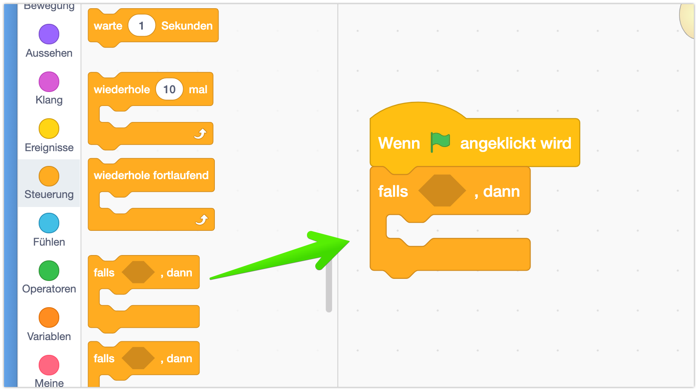

Die Eier werden auch als *Figur* angelegt.
Dazu erstellst Du als erstes eine neue Figur, diesmal malen wir die Figur aber selber, also wählst du "Malen":

Jetzt öffnet sich ein neue Bereich: Auf der rechten Seite kannst Du die neue Figur nun gestalten.

Hier siehst Du eine Übersicht der Funktionen:

Ich male mein Ei jetzt:

- Zuerst male ich eine Elipse (Kreis) den Umriss des Eis
- Über die Auswahl "Füllfarbe" kannst du nun die Farbe auswählen

Oben gibt es verschiede Optionen - ich habe "Verlauf" gewählt.
Damit kann man 2 Farben wählen - damit erzeuge ich den plastischen Effekt beim Ei.

> Du kannst natürlich das Ei gestalten wie du willst, oder auch ganz andere Sachen außer einem Ei nehmen.

Jetzt ist das Ei gemalt, und wir schauen uns mal die Eigenschaften der neuen Figur an:

## Eigenschaften der neuen Figur

Profi-Tipp: Als erstes gleich mal einen vernünftigen Namen für die Figur wählen! Das macht Dir die Arbeit später viel einfacher.

- Probiere doch jetzt mal aus, die Figur sichtbar und unsichtbar zu machen! Das geht mit dem "Auge"
- Meine Figur ist noch zu groß - über die Eigenschaft "Größe" kannst Du sie kleiner machen. 30 Ist bei mir genauch richtigp

# Programmierung der Figur.

Ich möchte jetzte, dass das Ei verschwindet, wenn es von meiner Spielfigur eingesammelt wird. 
Hm, wie geht das jetzt am besten?

Dazu nutzen wir einen:

## Bedingungen: Falls-Dann Block

Mit dem "Falls-Dann" Block, den du unter "Steuerung" (Orange) findest, kannst du bestimmten Programmcode nur unter einen bestimmten Bediengung ausführen:

Und die Bedingung ist, dass das Ei eben Dot, meine Hauptfigur berührt.
Das kann das Ei "fühlen" - über den Block **"wird .... berührt"** - der ist unter der Kategorie "Fühlen"

